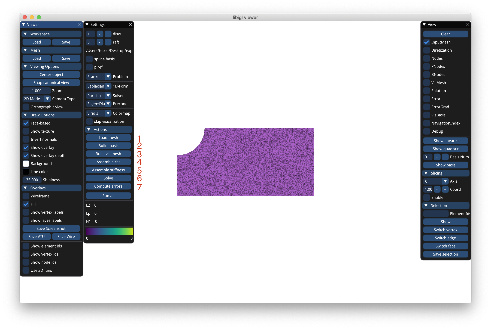
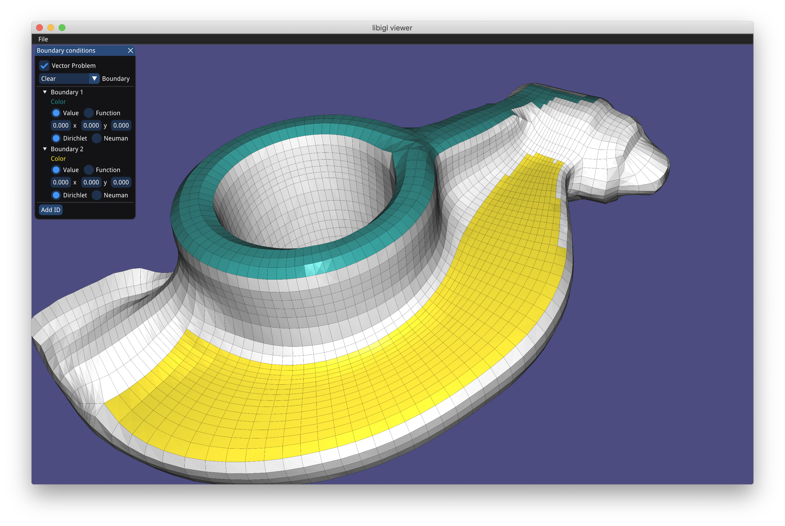

Tutorial
========

[Here](img/plane_hole.obj) you can find the *plate with hole* mesh used in this tutorial.


UI
---

Start the program with `PolyFEM_bin` this will open the UI.
Press the load button to load a mesh


Then press the numbered button in sequence:

1. Loads the mesh and normalized it
1. Builds the FEM bases, you can change the order by changing discr. To enable *pref* or *spline* check the corresponding boxes (before pushing the button)
1. Build a denser mesh for visualization purposes.
1. Assembles the right-hand side of the problem. You can change the problem with the problem drop-down menu
1. Assembles the matrix. You can change the formulation by changing the drop-down 1D nD form. The type of formulation depends on the problem. For instance, Franke works only with scalar formulations, while Elastic only with tensor problems.
1. Solve problem solves the problem.
1. You can compute the error for problems with given exact solutions. In case of no exact solution, the program will compute the norms of the solutions


At the end you can press save VTU to save the `result.vtu` file in the binary directory. This file can be opened with [Paraview](https://www.paraview.org/)


JSON
----

To run the previous experiment with a json file create a `run.json` containing (refer to [documentation](documentation.md) for the full description):

```json
{
    "mesh": "<mesh.obj>",
    "normalize_mesh": true,

    "n_refs": 0,

    "scalar_formulation": "Laplacian",

    "discr_order": 1,
    "use_spline": false,
    "use_p_ref": false,

    "output": "<stats.json>",

    "problem": "Franke",

    "export": {
        "vis_mesh": "<result.vtu>",
    }
}
```

Then run `PolyFEM_bin --json run.json --cmd`. You can omit the `--cmd` argument to open the UI with the parameters.

Boundary Conditions
-------------------

For more advanced problems such as `GenericTensor`, `TorsionElastic`, or `DrivenCavity` the boundary conditions might be different for each boundary. For instance, for the `TorsionElastic` problem you need to specify which part is fixed and which part moves. Polyfem uses boundary tags to mark boundary primitives (edges in 2D and faces in 3D). By default:

- in 2D all edges which barycenter is close up to 1e-7 to the left side of the bounding box gets tag 1, the right side gets 3, bottom 2, and top 4. Any other boundary gets 7.
- in 3D the threshold is a bit larger (1e-2) and x-direction gets 1, 3, y-direction gets 2, 4, and z-direction gets 5, 6. Any other boundary gets 7.

You can also specify a file containing a list of integers per each edge/face of the mesh indicating the tag in the json value `bc_tag`.

If you want to run the *real* plate with hole problem you need to choose `GenericTensor` as problem, set the correct Lame constants in `params`, and specify the proper boundary conditions in `problem_params`. For this example, we want Neumann boundary condition of [100, 0]  (a force of 100 in x) applied to the whole right side (pulling), so in the `neumann_boundary` array of `problem_params` we add an entry with `id` 3 and value [100, 0].
For the 2 Dirichlet is a bit more complicated because we want reflective boundary condition, that is we want to fix only one of the 2 coordinates. For instance, the right part of the mesh (id 1) needs to be fixed in x (or equivalent can move only in y-direction). To do so we add an entry to the `dirichlet_boundary` array with `id` 1 and `value` [0, 0], that is zero displacement, and specify which `dimension` these boundaries needs to be applied, in this case only the x-direction so `dimension` gets the value `[true, false]`. Similarly, the top part (id 4) gets `dimension=[false, true]`.


```json
{
	...

    "problem": "GenericTensor",

    "params": {
        "E": 210000,
        "nu": 0.3
    },

    "problem_params": {
        "neumann_boundary": [{
            "id": 3,
            "value": [100, 0]
        }],

        "dirichlet_boundary": [{
            "id": 1,
            "dimension": [true, false],
            "value": [0.0, 0.0]
        }, {
            "id": 4,
            "dimension": [false, true],
            "value": [0.0, 0.0]
        }]
    }
}
```

Note that as value you can also specify an expression as string depending on x,y,z and Polyfem will evaluate that expression on the edge/face.

Since creating the file with association from boundary to id it is complicated, we also provide an application `bc_setter` to interactively *color* faces of 3D meshes (or edges of 2D meshes) and associate tags. By *shift* clicking you can color coplanar faces to assign and id (*command* or *control* click colors only one face). The UI also allow to specify the 3 values (for scalar problem only one) to assign to that boundary condition and choose between Dirichlet and Neumann. On save it will produce the txt file with the tags to be used in `bc_tag` and a json file to set the `problem_params`. Note, if you selected the vector problem you need to use `"problem": "GenericTensor"` otherwise `"problem": "GenericScalar"`.




Selections, Multi-material, and Collisions [Beta]
-------------------------------------------------


The new release of PolyFEM support multi-material. For example if we want to simulate a sphere of radius 0.5m centered on $[0,1,0]$ with material $E=10^8, \nu=0.4, \rho=2000$ falling on thin soft mat  ($E=10^6, \nu=0.4, \rho=1000$) we need to set the body id. To set the body ids we can use selection, that is add this to the main json file:
```json
"body_ids": [{
    "id": 1,
    "center": [0.0, 1, 0],
    "radius": 0.6
}, {
    "id": 2,
    "axis": -2,
    "position": 0.01
}]
```
The sphere will be body 1, the selection is a sphere, for the mat the selection is an "axis-plane". For axis-planes the axis (1,2,3) represent $x,y,z$, the sign indicates the direction of the plane, and the position the offset. For this example, we are setting body id 2 to everything that has $y$-coordinate less than 0.01m (i.e., the thin mat). Using the body ids we can set the per-body material parameters by adding to the json
```json
"body_params": [{
    "id": 1,
    "E": 1e8,
    "nu": 0.4,
    "rho": 2000
}, {
    "id": 2,
    "E": 1e6,
    "nu": 0.4,
    "rho": 1000
}]
```
Where the id points to the selection.

Selections can be used to set boundary conditions too. For our example we want to fix the 4 sides of the mat, that is set zero Dirichlet. thus we need to select faces that are left/right top/bottom and assign to them side-set 2 (we are again using axis-planes selections):
```json
"boundary_sidesets": [{
    "id": 2,
    "axis": -1,
    "position": -0.99
}, {
    "id": 2,
    "axis": 1,
    "position": 0.99
}, {
    "id": 2,
    "axis": -3,
    "position": -0.99
}, {
    "id": 2,
    "axis": 3,
    "position": 0.99
}]
```

The final piece is to use a Generic tensor problem `"problem": "GenericTensor"` and specify boundary conditions and rhs (for the gravity):
```json
"problem_params": {
    "is_time_dependent": true,

    "dirichlet_boundary": [{
        "id": 2,
        "value": [0, 0, 0]
    }],

    "rhs": [0, 9.81, 0]
}
```

Since this is a contact problem we need to enable collision, **no other thing is needed**: `"has_collision": true`, and run the simulation (the complete json script can be found [here](img/sphere-mat.json)).

